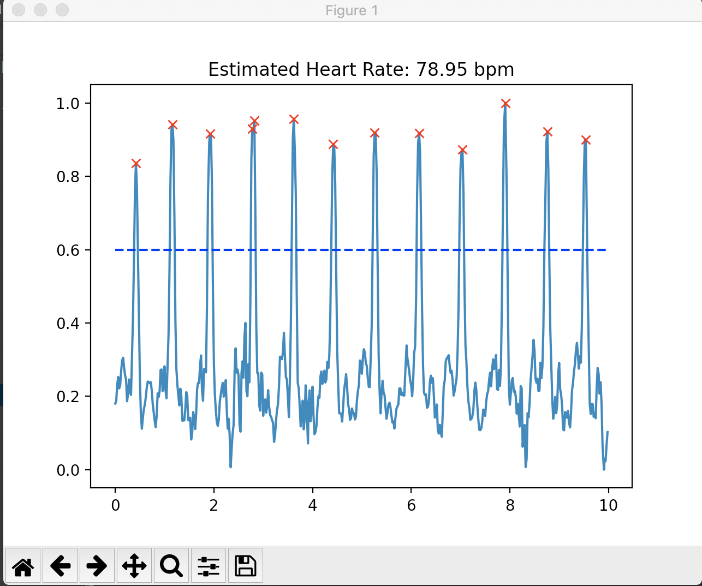

# Python Code for Lab 6

## Summary
> For this lab, the ultimate goal was to build an accurate heart rate monitor 
> which sampled photosensor values to analyze 
> the data sampled from our Arduino Code. Similar to last lab, digital signal 
> processing was a key component to filtering signals to produce a better representation 
> of our data and accurate heart rate. Moreover, we were given a baseline filtering 
> algorithm that was slightly different than the process for the Pedometer, and were asked 
> to improve on this and identify any weaknesses in the challenges.

## tutorial_ppg
> This python code worked in tandem with the code from the Arduino folder 
> that sampled both accelerometer and photosensor values. With this code, we received the acceleration 
> readings (in x, y, and z direction) and the photosensor samples
> via Serial communication. Then, using Matplotlib, we used subplots to live plot all 
> of these values so we could check if we were properly sampling from these devices. 

    # add the new values to the circular lists to keep track of values
    times.add(int(m1))
    ax.add(int(m2))
    ay.add(int(m3))
    az.add(int(m4))
    ppg.add(int(m5)) 
    
    # How we live plotted these values:
    plt.clf()
    plt.subplot(411)
    plt.plot(ax)
    plt.subplot(412)
    plt.plot(ay)
    plt.subplot(413)
    plt.plot(az)
    plt.subplot(414)
    plt.plot(ppg)
    plt.show(block=False)
    plt.pause(0.0001)
---
## tutorial_ppg_filtering
> This file introduced us to the baseline filtering we would perform on the ppg data. 
> The filtering for this process was slightly different then the Pedometer class because the PPG 
> data had different trends and structure. Some key differences for this filtering was first normalizing the 
> signal, allowing us to have a consistent threshold when detecting peaks. Moreover, 
> we also took the derivative of the signal to accentuate the peaks and make more defined peaks. Once we filtered the signal.
> we calculated the heart rate by taking average time in between each peak and dividing this result 
> by 60 to get the beats per minute. This process was replicated in the HRMonitor class, 
> which performs this process in the process() method. 

    # Filtering process in the HR Monitor class 
    x = filt.detrend(x, 25)
    x = filt.moving_average(x, 5)
    x = filt.gradient(x)
    x = filt.normalize(x)
---  
## tutorial_ml_data
> For this tutorial, we were required to sample good data from the photosensor 
> and save it to a csv file. These pieces of data will be combined later in the next lab 
> to be used as training data for a ML algorithm that will be able to detect the heart beat. 
> A process was set up where we could easily collect data and then save it to a csv file afterwards. 

    # Get data from the MCU and save it if getting new data
    if(collect_new_data):
      data = collect_samples()
      save_data(filename, data)
---
# Challenge 1 
> When analyzing bad data and how our baseline filtering algorithm detected peaks, we noticed 
> that sometimes there would be peaks extremely close to each other that were "outliers" and should 
> not be counted. For example, in this image that two peaks were counted when in reality only one peak 
> should have only been detected. 

 

> In our improved algorithm, we look at the average time difference for each peak. 
> If the time difference was 2 standard devations less than the average, then the peak 
> must have been an outlier, so it would be removed from the peak list. This code 
> was added as a separate method onto the HR Monitor Class that would be called in the 
> process() method. 

    for i in range(len(peak_diff)):
        # If the peak difference is less than 2 deviations from the average, remove the peak (outlier)
        if peak_diff[i] < (avg_peak_diff - (2 * std_peak_diff)):
          del peaks[i + 1]
          
> Here is the new 
> filtering data with the one outlier removed:

> This would help improve the heart rate algorithm by adjusting for any 
> noisy peaks that looked like it had two peaks. 
---
# Challenge 2
> Now, we had to apply our improved heart beat algorithm to a live setting. First, we 
> made a file that could access live samples from the photosensor. Using the HR Monitor class, we would then 
> filter these samples with the updated algorithm from challenge 1 every 1 second to get the heart beat.

    if (current_time - previous_time > process_time):
        previous_time = current_time
        try:
            heart_rate, peaks, filtered = hr.process()
        except:
            continue

> Once we calculated the heart rate, it would be displayed to the LED using Serial Communication
    comms.send_message("HR: " + str(int(heart_rate)) + " bpm")
> We also added some additional features to our code that detected if the HR Monitor had inaccurate readings. For example,
> if the person's finger was not on the photosensor, we would not display the heart rate on the LED.
    
    # Deals with any nonsensical heart beat readings
    if(heart_rate > MAX_HEART_RATE):
        plt.title("Inaccurate Reading")
        comms.send_message("Inaccurate Reading")

