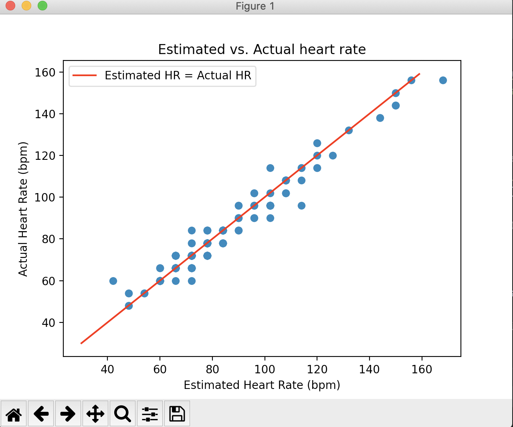
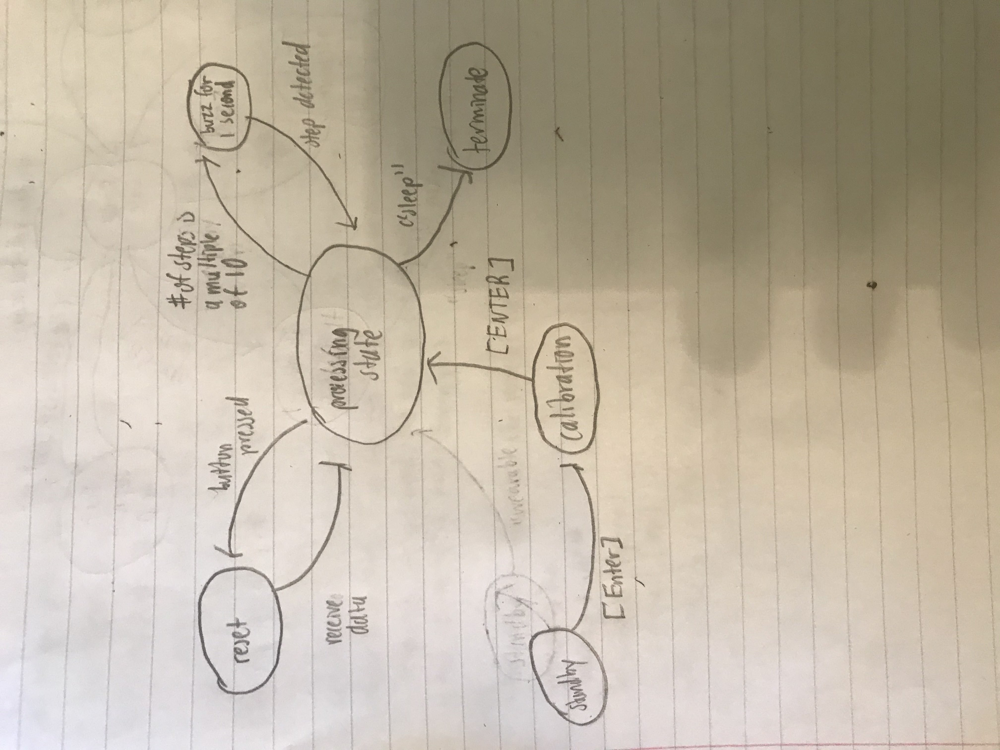

# Lab 7

## Summary 
> In this lab, we were introduced to machine learning, a powerful tool that 
> develops a model to make predictions based on previous data. We trained and implemented a Gausian 
> Mixture Model, a form of unsupervised learning, to cluster our ppg data into 
> heartbeats and non-heartbeats. Then in the challenges, we analyzed this algorithm's performance and utilized 
> it to perform live heart rate monitoring. Finally, our last challenge required us to use all the tools 
> we used from previous labs to build a complete wearable. 
---

## Tutorial 1: ML Data Preparation 
#### tutorial_ml data.py
> This tutorial introduced us to the python library glob, which is extremely
> helpful for search in a directory and retrieve files. We used this to access the 
> ml data we collected from last lab and then use the user-reported peak count 
> to calculate the true heart rate.

    # We used glob in this case to get the name of each person
    # who uploaded ppg data into the data folder 
    def get_subjects(directory):
        filepaths = glob.glob(directory + "/*")
        return [filepath.split("/")[-1] for filepath in filepaths]

---

## Tutorial 2: GMM HR Monitor
#### tutorial_gmm.py
> For this tutorial, we used the GMM package in scikitlearn to use 
> a Gaussian Mixture Model on our data. 

    train_data = np.array([])
    for trial in range(1,11):
        t, ppg, hr, fs_est = get_data(directory, subject, trial, fs)
        ppg_filtered = process(ppg)
        train_data = np.append(train_data, ppg_filtered)
    
    # Train the GMM with the training data
    gmm = GMM(n_components=2).fit(train_data.reshape(-1,1))
    
> First, we trained the model on a specific subject. Once the GMM was trained, it should 
> fit the distribution that our training data had very well. 

    # Test the GMM on the same training data... BAD!!!
    for trial in range(1,11):
        t, ppg, hr, fs_est = get_data(directory, subject, trial, fs)
        ppg_filtered = process(ppg)
        labels = gmm.predict(ppg_filtered.reshape(-1,1))

> One bad practice we did in this tutorial 
> is that we used the same train data for testing. This won't give a good measure 
> of how well our GMM is doing since it won't be able to generalize for other data from 
> other subjects. 
#### tutorial_gmm_losov.py
> In the previous tutorial, we did not test our GMM model well, as we used the same training 
> data for the test data. For this tutorial, we used Leave-One-Subject-Out-Validation on our model. 
> In this process, we exclude one subject, train the GMM with all the other data, and then test our model 
> using the excluded subject. We would continue this process, excluding a different subject each iteration 
> until every subject has been excluded. 
    
    # How we trained the data using LOSOV
    for exclude in subjects:
        print("Training - excluding subject: %s" % exclude)
        train_data = np.array([])
        for subject in subjects:
          for trial in range(1,11):
            t, ppg, hr, fs_est = get_data(directory, subject, trial, fs)
            
            # --- DON'T INCLUDE THE EXCLUDED SUBJECT IN TRAINING DATA --
            if subject != exclude:
              train_data = np.append(train_data, process(ppg))
              
    # Train the GMM without excluded data 
    train_data = train_data.reshape(-1,1) # convert from (N,1) to (N,) vector
    gmm = GMM(n_components=2).fit(train_data)

---

## Challenge 1: GMM Performance
> In this challenge, we were required to use numerical error measurements 
> such as RMSE to evaluate the performance of our GMM model. 

> First, to get a visual representation of our GMM model, we plotted the
> predicted heart rate values versus the actual heart rate. 

> The root mean square we would get was around 4.49. Looking at our plot, 
> we can see that this value is expected, as the estimate heart rate from the GMM
> model is not always equal to the actual heart rate. Sometimes the model can slightly 
> underestimate or overestimate our data, so it should have reasonable root mean square error.
 
> We also quantified the performance of our algorithm using two other error metrics: The R-squared score, which measures 
> how well our model fits the data, and the model accuracy, which is the percentage of correct predictions.

    # Code to compute R2 score and accuracy 
    
    def compute_r2_score(hr, hr_est):
      return r2_score(hr, hr_est)

    def compute_accuracy(hr, hr_est):
      correct_pred = [hr[i] for i in range(0, len(hr)) if hr[i] == hr_est[i]]
      return len(correct_pred)/len(hr)

> The model's accuracy was around 57%, which meant the model predicted the same heart rate 
> as the actual one 57% of the time. A lot of ML algorithms with more training data can reach more than 90% accuracy, so maybe if we collected
> more training data we could improve the accuracy of the GMM model. The R2 score was 0.95, with a score of 1 meaning 
> that our model perfectly fits the actual heart rates. Since the score was close to 1, this means that the GMM did a good job 
> of generalizing and could fit a good amount of the test data. 
---

## Challenge 2: GMM Hr Monitor 
> Now that we knew how to train the GMM model and then use it to make heart rate predictions, 
> this challenge required us to use it to make live heart rate predictions. To achieve this, we first had to train 
> our model with the training data we had collected before. To do so, we added 
> a train() method in the HRMonitor class that loads this data and trains. This also required 
> us to use the same helper methods from previous tutorials that utilize the glob library 
> to load all the data.

    """
    Trains the GMM model on offline data 
    @:return: the trained GMM model 
    """
    def train(self):
        print("Training GMM model... ")
        subjects = self.get_subjects(self.__directory)
        train_data = np.array([])
        for subject in subjects:
          for trial in range(1,11):
            t, ppg, hr, fs_est = self.get_data(self.__directory, subject, trial, self.__fs)
            train_data = np.append(train_data, self.train_process(ppg))
    
        # Train the GMM
        train_data = train_data.reshape(-1,1) # convert from (N,1) to (N,) vector
        self.__gmm = GMM(n_components=2).fit(train_data)
        
> Once we had trained the GMM model, we were ready to make live predictions on the 
> heart rate! Just like the train() method, we added a predict() method in the HRMonitor class
> as well. In this method, we used a similar approach to the process() method in the HRMonitor
> class, grabbing the new raw ppg samples and then filtering this data. Then, with all the filtered data, 
> we performed predictions with the GMM model to compute the estimated heart rate. 

    """
    Uses the GMM model to estimate the heart rate 
    @:param filtered: the filtered data
    @:param fs: the sampling frequency
    @:return: the estimated heart rate and estimated time of each peak 
    """
    def predict(self):
        # Grab only the new samples into a NumPy array
        x = np.array(self.__ppg[-self.__new_samples:])
        filtered_arr = self.train_process(x)
        self.__filtered.add(filtered_arr.tolist())
        labels = self.__gmm.predict(np.array(self.__filtered).reshape(-1, 1))
        self.__new_samples = 0
        hr_est, est_peaks = self.estimate_hr(labels, len(self.__filtered), self.__fs)
        return hr_est, est_peaks, np.array(self.__filtered)
---

## Challenge 3: Complete Wearable 
> For this challenge, we had to combine all the code we used in previous labs and make a complete wearable that 
> can measure the step count and heart rate while also using the buzzer and pushbutton as well.

> NOTE: I had lost my pushbutton after flying back home from college, so my video doesn't show the 
> pushbutton behavior, but I have the code for how it would be used. 

> Here is the state diagram for our wearable device:

#### Standby state
> This is the state prior to calibration where the device waits for user input. In this state, the GMM for heart rate measureing is first trained with the offline data. 
> Then, the program would wait for the user to press enter, which 
> will then trigger the calibration state

    input("Walk for 10 seconds to calibrate the pedometer. Press [ENTER] to begin.\n")

#### Calibration State
> In the Calibration State, we would record user data from the accelerometer for 10 seconds. Then, we would 
> process this data to find the average peak value, which would allow us to use better thresholds for step detection. This 
> was a similar process to what we did in our Lab 5 Pedometer challenges.
> Once the thresholds were better fit for the user, we would wait for the user to press enter, 
> which would then start the processing state.

#### Processing state
> The Processing state was the main state of our code. In this state, messages will be sampled from the Arduino, which can contain accelerometer and PPG data 
> or other keywords that signify a state transition. Similar to the previous live sampling challenges for the Pedometer and 
> heart rate monitor, we would process this data every second to get the step count 
> and heart rate. Once we processed the data and calculated the heart rate and step count, we would 
> send a message to the Arduino code containing all the information to display on the LED. 
     
     # Add accelerometer and ppg data 
     ped.add(int(m2), int(m3), int(m4))
     hr.add(int(m1)/1e3, int(m5))
     
     # Process the data every 1 second 
     if current_time - previous_time > process_time:                     
        previous_time = current_time                                                                                                 
        try:                                                            
            # process the pedometer data                                
            steps, ped_peaks, ped_filtered = ped.process()                                                                       
            # with the processed data make a prediction using GMM model 
            hr_est, hr_peaks, hr_filtered = hr.predict()                
        except:                                                         
            continue
     
     # Create and send the message to be displayed on the LED
     comms_message = create_message(hr_est, steps, weather, initial_period)
     comms.send_message(comms_message)                                                
 
#### Buzz state 
> Once we had processed the data, we would check if the user has taken ten steps. If so, we would 
> buzz the motor for 1 second. This state is left once another step is detected, bringing us back 
> to the process state. 

    # everytime the person has taken 10 steps buzz the motor    
    if steps % 10 == 0 and steps != 0:                          
        comms.send_message("buzz")     

#### Reset state 
> While we received messages from Arduino, sometimes the Arduino could send a "reset" message to indicate that the 
> button has been pressed. If so, then this means that the step count had to be reset to zero. We left this 
> state once we received more data and entered the process state
    
    if message == "reset":
        ped.reset()

#### Termination state
> Once the user pressed control c, the wearable device will essentially turn off. The "sleep" message 
> will be sent to the MCU which prevent any sampling from the PPG and the accelerometer. 

    except(Exception, KeyboardInterrupt) as e:
        print(e)  # Exiting the program due to exception
    finally:
        print("Closing connection.")
        comms.send_message("sleep")  # stop sending data
        comms.close()

                         

---
