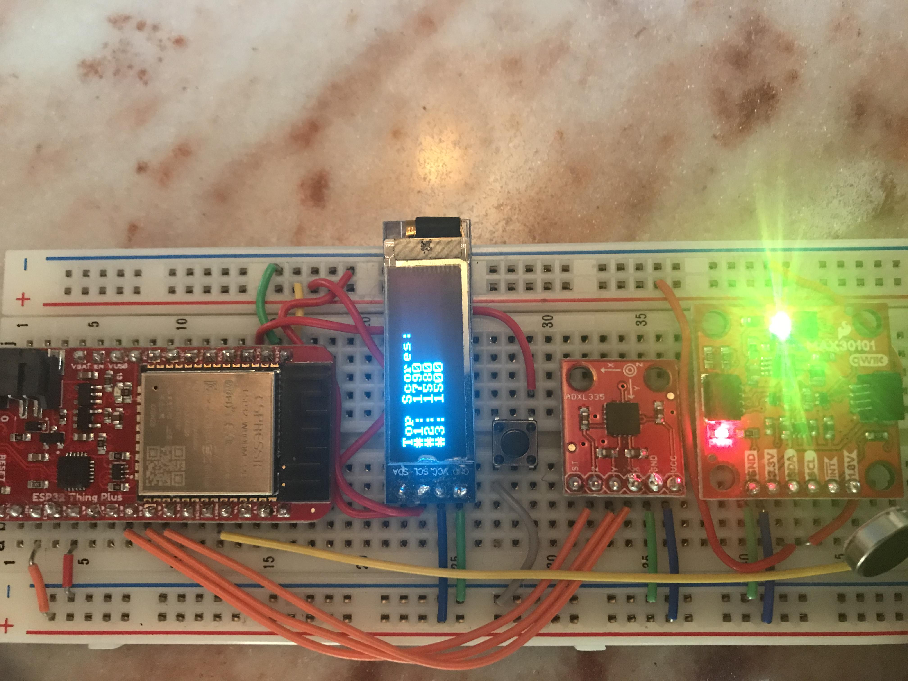

# Grand Challenge: Space Invader Controller
## Akshay Gopalkrishnan A15832133, Aditi Anand A15461292
## Summary
> For our last challenge, we were given code for the game Space Invaders and some baseline code 
> that allowed us to use our MCU as a controller for this game. However, there were a lot of weaknesses 
> in this original controller, so our job was to recognize these issues and find ways we could improve the design. 
> Not only did we have to improve some of the workings of our controller, but we also had to add new features 
> that would improve the overall gameplay. These new improvements and features are detailed throughout this file.
---

## Using the Controller
#### Moving 
> In order to use the controller, hold the breadboard horizontally and have the surface of the 
> breadboard face up. To move left, simply tilt the 
> device to the left. To move to the right, tilt the breadboard to the right. 
#### Firing 
> In order to fire, tilt the device forward. You can move left/right and fire 
> at the same time by tilting the breadboard 
> to either the left/right and tilting the breadboard forward.  
#### Other features 
> You can pause/play the game by pressing the pushbutton on the breadboard. 
---

## Improvements in the Controller 
#### Lag 
> While experimenting with the original design of our controller, we noticed that there was a huge lag that would build up 
> with the controller movements. As a result, while playing the game, sometimes the current orientations being detected 
> would not be the commands currently being used in the game. This happened because before the start of the game and in between 
> games, the orientations would still be sampled from the accelerometer. As a result, this would create a huge 
> buffer when we actually starting playing since all the previous orientation commands would be used. Our solution to this problem 
> was the stop any sampling from the accelerometer until the game is actually being played.
##### In space_invaders_controller.py:
    self.comms.send_message("stop")
    self.comms.clear()
    
    print("Waiting for game to start...")
    while True:
      # Wait for user to start game before sampling orientation data
      game_status = self.receive_from_server()
      if game_status == "START":
        print("Game started!")
        self.comms.send_message("start")
        break
##### In spaceinvaders.py:
     # Tell the controller to start sampling orientation
     mySocket.sendto("START".encode('utf-8'), client_ip_address)
> In our controller code, when the game initially starts we would not sample from the accelerometer. Then, the sampling from the accelerometer 
> would only start when the game code sent the "START" message to our controller, which was triggered when the user entered a key 
> and begin the game. As a result of this, there was no lag with the controller, and the current orientations alligned with the 
> game command. 

> We would also repeat this process for when the user loses a game, turning off any sampling until the user 
> is ready to start another game.

#### Decoupling Firing and Moving 
> With the original controller code, we could not simultaneously fire and move at the same time. If the user 
> was trying to do so, they would both tilt the device left/right and tilt the device forward as well. To detect this orientation, 
> we had to check the x and y values from the accelerometer. Here is the code detecting these orientations:

    else if(abs(x) > sensitivity && abs(y) > sensitivity && abs(x) > abs(z) && abs(y) > abs(z))
    {
        // If the device is to the left and pointed down, it should be moving left and firing
        if(x<0 && y > 0)
            orientation = 5;
        // If the device is to the right and pointed down, it should be moving right and firing
        else if(x> 0 && y>0)
            orientation = 6;
    }

> To be moving left/right and firing, the x and y values had to be displaced from the rest acceleration values by a certain 
> sensitivity number, which my partner and I found through looking at the Serial plots of the acceleration values. If both the 
> x and y acceleration 
> values were passed these thresholds, then we would know that the device is pointing down/up and moving left/right. 
> If their device was tilted to the left and down, then in the game they should be firing and moving to the left. If the device was tilted to the right and down, then 
> in the game they would be moving to the right and firing. 

> On the Python side, we would then receive these commands in the controller code and send these commands through socket communication 
> to the game code. In the game code, we made sure that these commands would both move the player and initiate the firing animation. 

##### From space_invaders_controller.py:
    elif message == 5:
        command = "FIRE LEFT"
    elif message == 6:
        command = "FIRE RIGHT"
    if command is not None:
        mySocket.send(command.encode("UTF-8"))

##### From spaceinvaders.py:
    # If the message was either "FIRE LEFT" or "FIRE RIGHT"
    elif len(msg) > double_command_length:
        self.fire() # firing animation
        self.player.update_udp_socket(msg[double_command_length:]) # movement will either be LEFT or RIGHT
---

## New Features in the Controller
#### Buzzing the motor
> One feature we added was to buzz the motor whenever the player was hit by the enemy. To do so, we had to 
> first establish a communication between the client and server, allowing us to send messages between both of them. 
> In order to buzz the motor, we would first need to detect it in the game code, which occurs 
> in the check_collisions() method.
> Once we knew the player was hit, we would send a message via 
> socket communication telling the controller to buzz the motor
##### spaceinvaders.py
    mySocket.sendto("BUZZ".encode('utf-8'), client_ip_address)

> Then once we received this message in the
> controller code, it would then send a message to the Arduino code to buzz the motor.   
##### space_invaders_controller.py
    # Controller receives it and tells the Arduino code to buzz the motor 
    # If the player has been hit, buzz the motor
    elif game_status == "BUZZ":
      print("Player hit!")
      self.comms.send_message("buzz")

> Then once we received this message in the
> controller code, it would then send a message to the Arduino code to buzz the motor.    
##### SpaceInvadersController.ino
    
    // If the buzz command is sent start buzzing the motor 
    else if(command == "buzz")
    {
       buzz = true;
       activateMotor(255);
       last_buzzed = millis();
    }
    // If it's been one second since the buzz message has been sent deactivate the motor 
    if(buzz && millis() - last_buzzed > 1000)
    {
        deactivateMotor();
        buzz = false;
    }

#### Pausing the game 
> For our controller, we would pause and continue the game using the pushbutton. In this case,
> the button being pressed would first be detected in the Arduino code. We used a boolean called pause_game
> that would toggle between true/false to represent when the game was paused or ready to play. Once we detected 
> the button being pressed, we would send a message to the controller telling to either stop or 
> continue the game. 
##### SpaceInvadersController.ino
    if(buttonPressed() && sending)
    { 
        pause_game = !pause_game;
        if(pause_game)
        {
            sendMessage("10");
            writeDisplay("Paused.", 0, true);
        }
        else
        {
            sendMessage("11");
            writeDisplay("Playing!", 0, true);
        }
    }
    
> Once we received the message in the Python controller code, we would then send a message to the 
> game code through socket communication that the game must be stopped or continued. 
##### space_invaders_controller.py
    message = self.comms.receive_message()
    elif message == 10:
        command = "PAUSE"
    elif message == 11:
        command = "PLAY"
    if command is not None:
        mySocket.send(command.encode("UTF-8"))

> Then in the python game code, when this command is received, a variable called pause_game would 
> set the true. When this variable is true, all animations and movements would be bypassed and essentially 
> freeze the screen. The game would continue again once the user pressed the pushbutton again, which would send the 
> "PLAY" message to the game code which would then continue the game.
##### spaceinvaders.py  
    # in check_input_udp_socket()
    elif msg == "PAUSE":
        print("Game Paused.")
        self.pauseGame = True
    elif msg == "PLAY":
        print("Game resumed")
       self.pauseGame = False
       
    # in main()
    elif self.pauseGame:
        self.check_input_udp_socket()

#### Displaying the Top Three Scores on the LED 
> After each game was over, the score of the round would be recorded, and the top three scores 
> recorded with this controller would be displayed. Here is an example that shows what the LED would show:

> To do this, after each game was over we would first send the score from the Python game code 
> to the Python controller code using Socket communication.
##### spaceinvaders.py
    # Tells the controller that the game is over and sends the score from the round
    msg = "GAME OVER," + str(self.score)
    mySocket.sendto(msg.encode("UTF-8"), client_ip_address)

> Once the python controller code received this message and the score from last round, it would then 
> compare this score to the top three scores of the user. These would be stored in the file topscores.csv, which is populated 
> with the three best scores the user has ever achieved. First, we would access these scores from the file. To update the top three scores, we 
> added the score from the last round to the top three scores, sorted this list from greatest to least, and then returned this list excluding 
> the last element which would be the lowest score. Then, we created a message using the top three scores and sended 
> this to the Arduino to display on the LED. 

##### space_invaders_controller.py
    # Access the score from the last round 
    score = game_status.split(",")[1] # Get the score from the last round
    message = self.update_top_scores(int(score)) # Update the top three scores
    
    # Load the top three scores from the file and sort them
    # from greatest to least
    top_scores = list(self.load_data(self.filename))
    
    # Update the top three scores
    top_scores.append(score) # add the score from last round to the top scores
    top_scores.sort(reverse=True) # sort all the scores from greatest to least
    return top_scores[:len(top_scores)-1] # return the new top scores with the lowest score removed
    
    # Create and send the message to the MCU with the top three scores
    message = "Top Scores:" + "," + "#1: " + str(int(top_scores[0])) + "," + "#2: " + str(int(top_scores[1]))
    message = message + "," + "#3: " + str(int(top_scores[2]))
    self.comms.send_message(message) # send the top three score to the MCU

> Now, the Arduino would check if it received this message containing the top scores. Then, using 
> the displayCSV() method in the Display tab, it would show these scores on the LED.
##### SpaceInvadersController.ino
    // If the command shows the top three scores, write them to the LED Display
    else if(command.substring(0,3) == "Top")
    {
        writeDisplayCSV(command, 3);
    }

---
    